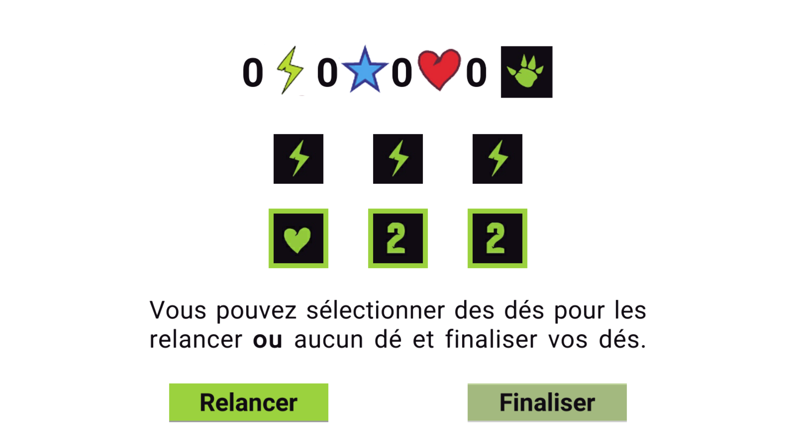

# ProjetFinEtudes

- [x] [Sprint 1](https://github.com/GameDevPyro/ProjetFinEtudes#sprint-1) 
- [ ] [Sprint 2](https://github.com/GameDevPyro/ProjetFinEtudes#sprint-2)
- [ ] [Sprint 3](https://github.com/GameDevPyro/ProjetFinEtudes#sprint-3)

## Sprint 1

### Installation
1. Télécharger le [fichier](https://minhaskamal.github.io/DownGit/#/home?url=https://github.com/GameDevPyro/ProjetFinEtudes/tree/master/Sprint_1).
2. Dézipper le fichier.
3. Ouvrir Sprint_1.exe

## Sprint 2

## Sprint 3
